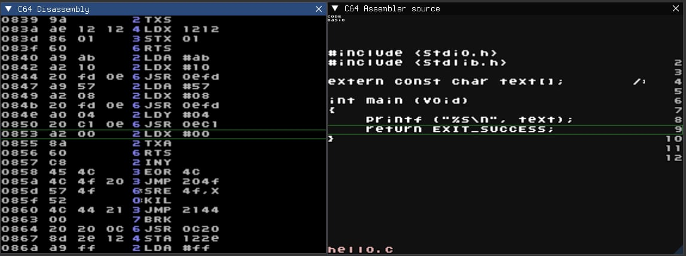

# ld65-to-kickasm-debuginfo-converter

Conversion script for converting debuginfo from the [The cc65 cross-compiler suite](https://github.com/cc65/cc65) to kick-assembler format for use with [RetroDebugger](https://github.com/slajerek/RetroDebugger)

This allows you to do source-level debugging in the RetroDebugger. I developed this while making a little 4K Commodore 64 game called [Tsunami Tōsō](https://galfodo.itch.io/tsunami-toso-4k) where it came in quite handy. 

# Usage


```

usage: convert_ld65_to_kickasm_dbg_format.py [-h] [-o OUTPUT_FILE] [-v] [-q] [FILE]

Convert ld65 debug info file to Kick Assembler format usable by Retro
Debugger.

positional arguments:
  FILE                  File to convert.

optional arguments:
  -h, --help            show this help message and exit
  -o OUTPUT_FILE, --output-file OUTPUT_FILE
                        Output filename.
  -v, --verbose         Display conversion information.
  -q, --quiet           Print no status information.

```

Building and converting should be pretty clear from the sample `Makefile`. The script takes a debuginfo file from `ld65` and outputs a RetroDebugger compatible one (in the example case: `hello.dbg`). The output format is the same as with [Kick Assembler](https://theweb.dk/KickAssembler/Main.html#frontpage) by Mads Nielsen. When used in the debugger, it will look something like this:



# Note

The script is based on a very rudimentary understanding of the ld65 debug format and can surely be improved. Contributions are welcome!

The script has only been tested with `ld65` version 2.19


